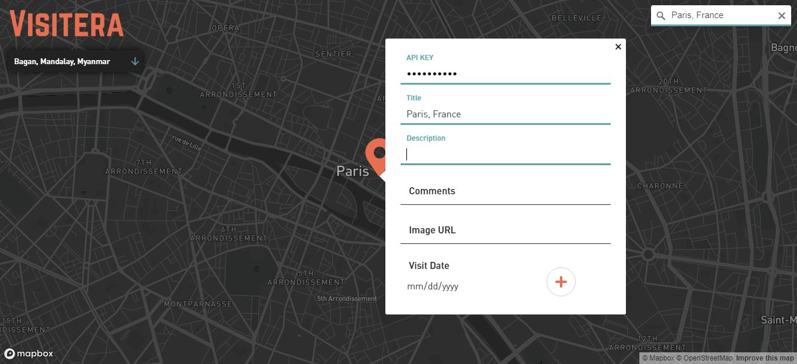
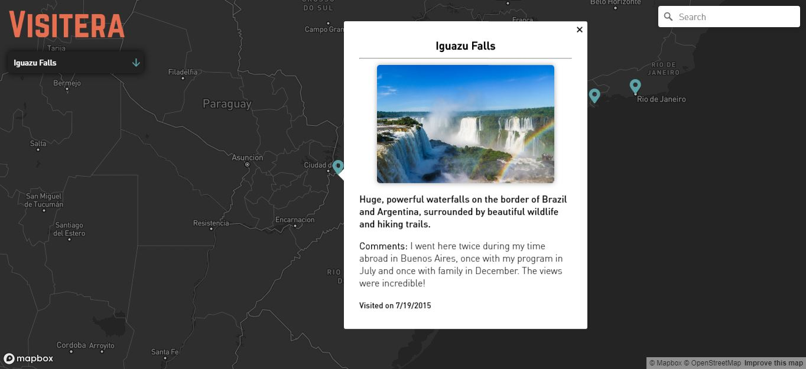

# 

[Go to the deployed application!](https://visitera.now.sh/)
_Disclaimer: The backend is deployed on Heroku which can be slow to load, so please allow a minute for the markers to populate._

Visitera is a personal travel log application built with a React front-end, a Node/Express backend, and a MongoDB database. It also uses Mapbox Maps SDK to embed a customized map, and a geocoder component to search for places using Mapbox Geocoding API.

I love to travel and wanted a way to keep track of the places I have been. With Visitera, users can double click anywhere on the map and add a new marker with information about their trip. Once added, users can click on their markers to view details that display in a popup.

Right now, you are required to enter an API key in order to add travels because I did not want everyone to be able to contribute their data. In the future, I would either like to have different colored markers for each user to add their own travel experiences, each with their own API key, or I will implement user login instead.

## Usage

- Use the dropdown menu or click a marker to view a log entry
- Use the search bar to navigate to a specific area of the map
- Double click to add a new marker
- Complete the form to add a log entry

## Preview

## Known Issues

This application is currently not very mobile friendly. I plan to make it more responsive in the near future.

## TODO

- [x] Setup Server
  - [x] Install Dependencies
  - [x] Install / Setup Linter
  - [x] Setup Express App
  - [x] Setup Not Found and Error Middlewares
- [x] Model DB
  - What data will be stored?
- [x] Setup Mongoose Model(s)
- [x] POST /logs
  - Create a new log entry
- [x] GET / logs
  - List all log entries
- [x] Setup Client
- [x] Create form to add a new entry
- [x] Setup Map SDK on client
- [x] List all log entries on map
- [x] DEPLOY!
