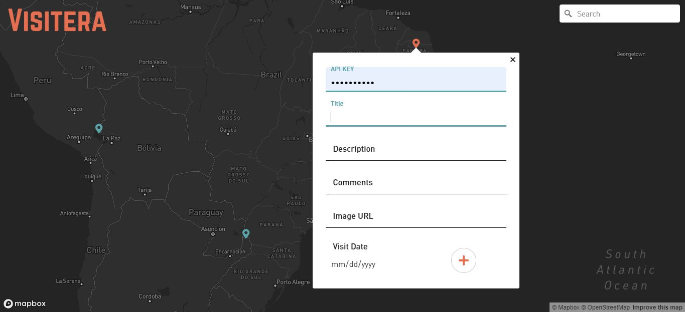
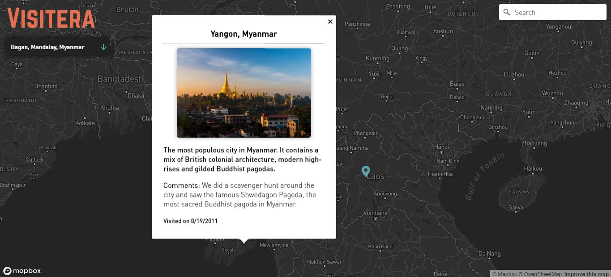

# 

Visitera is a personal travel log application built with a React front-end, a Node/Express backend, and a MongoDB database. It also uses Mapbox Maps SDK to embed a customized map, and a geocoder component to search for places using Mapbox Geocoding API.

I love to travel and wanted a way to keep track of the places I have been. With Visitera, users can double click anywhere on the map and add a new marker with information about their trip. Once added, users can click on their markers to view details that display in a popup.

Right now, you are required to enter an API key in order to add travels because I did not want just anyone to be able to contribute their data. In the future, I would like to have different colored markers for each user to add their own travel experiences, each with their own API key.

## Preview (Not yet complete)

## TODO

- [x] Setup Server
  - [x] Install Dependencies
  - [x] Install / Setup Linter
  - [x] Setup Express App
  - [x] Setup Not Found and Error Middlewares
- [x] Model DB
  - What data will be stored?
- [x] Setup Mongoose Model(s)
- [x] POST /logs
  - Create a new log entry
- [x] GET / logs
  - List all log entries
- [x] Setup Client
- [x] Create form to add a new entry
- [x] Setup Map SDK on client
- [x] List all log entries on map
- [ ] DEPLOY!
